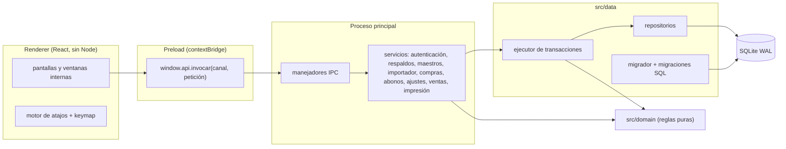
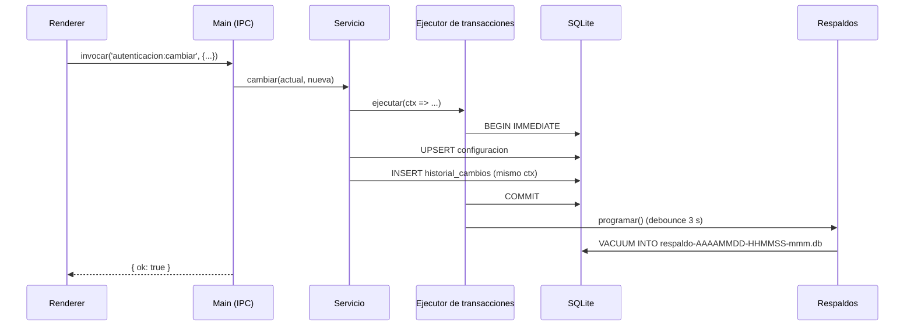
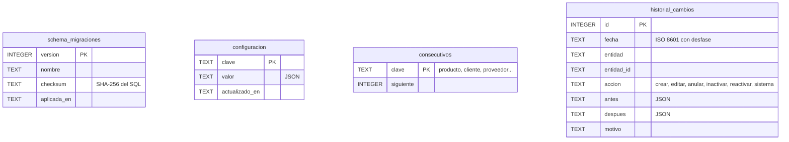
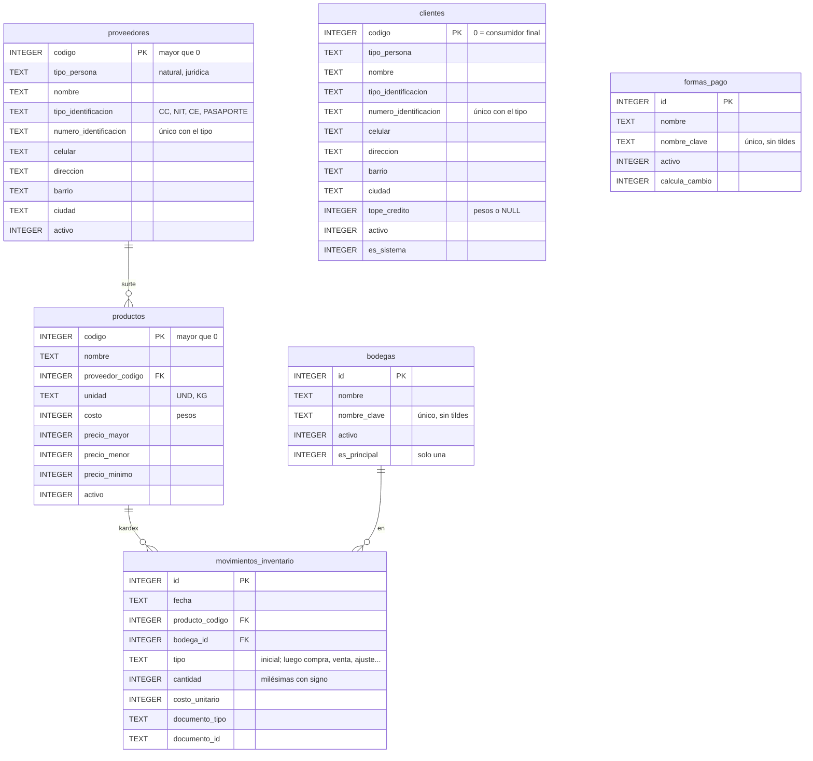
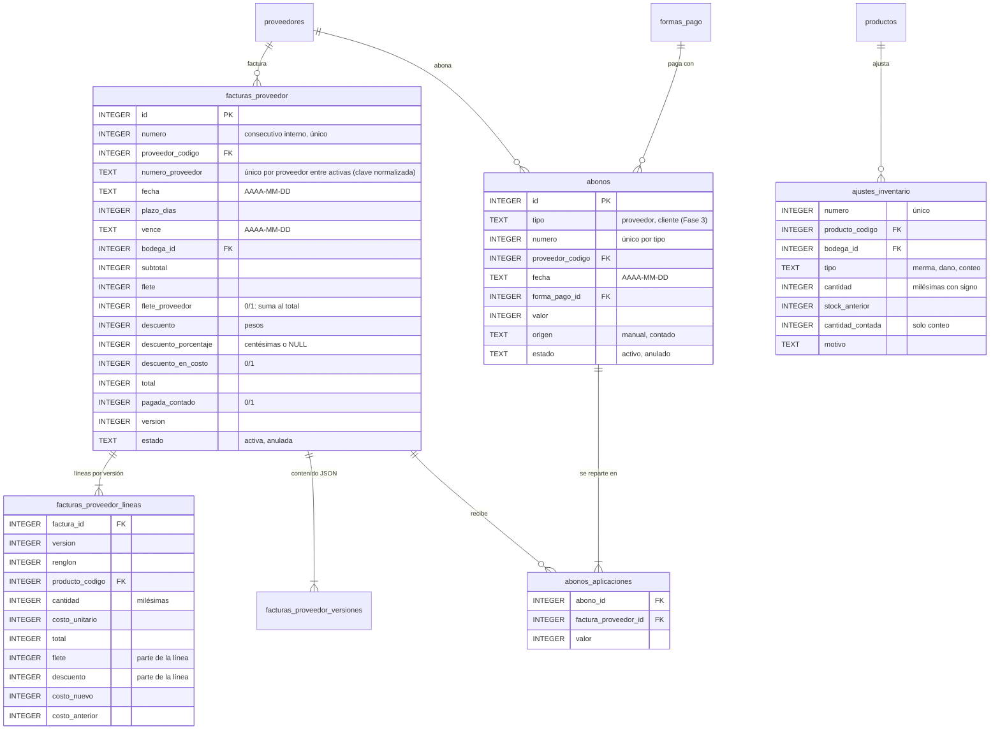
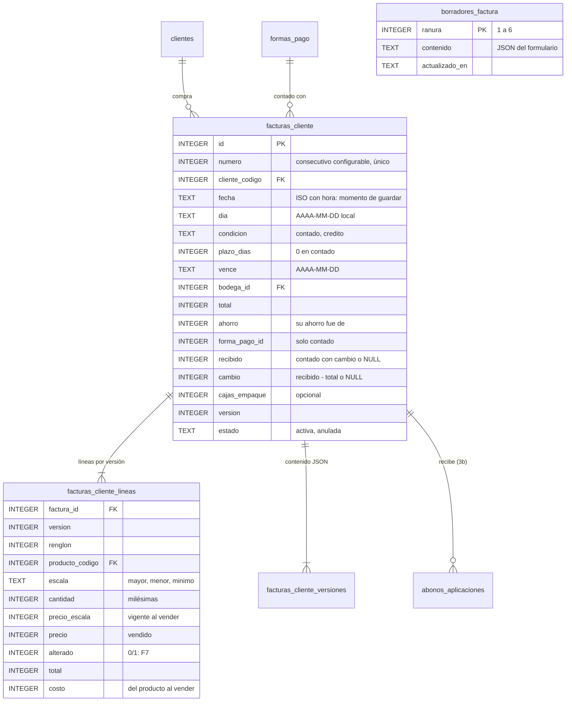
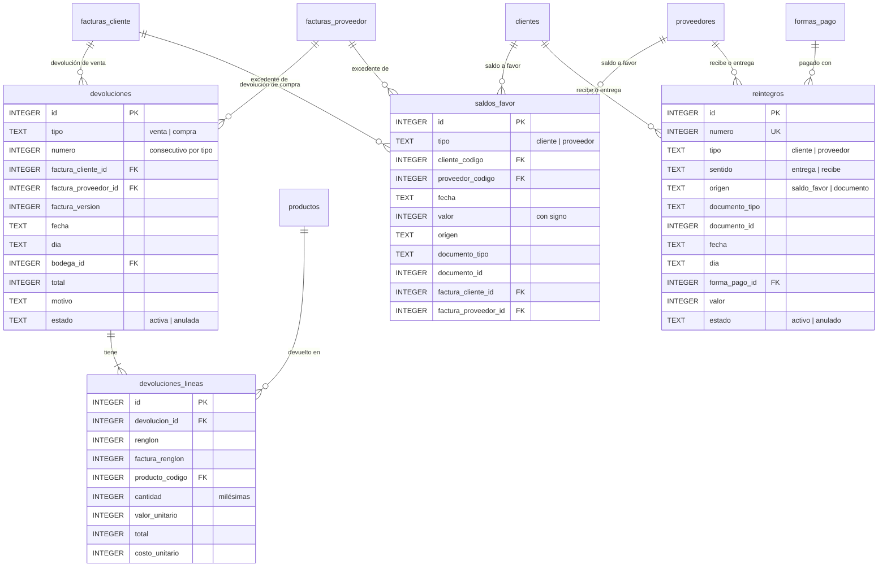

# Arquitectura

## Capas

La aplicación es una sola ventana de Electron. Las capas se comunican solo en el sentido de las flechas; ninguna se salta otra.

- **`src/domain/`**: reglas de negocio puras, sin Electron ni base de datos. Es lo más probado.
- **`src/data/`**: SQLite con `better-sqlite3` (síncrono). Toda escritura pasa por el **ejecutor de transacciones**, que abre una transacción `IMMEDIATE`, registra el historial de cambios en la misma transacción y, al confirmar, programa el respaldo.
- **`src/main/`**: arranque, ventana segura (`contextIsolation`, `sandbox`, sin `nodeIntegration`, CSP, sin navegación ni ventanas emergentes), IPC y servicios.
- **`src/preload/`**: expone solo `window.api` con una lista blanca de canales.
- **`src/shared/`**: contrato IPC tipado, `keymap`, catálogo de procesos y formatos. Lo usan todas las capas.
- **`src/renderer/`**: interfaz React. Puede importar funciones **puras** de `src/domain/` y `src/shared/` para mostrar cálculos mientras se escribe (p. ej. el % de ganancia o la sugerencia de columnas del importador). La validación definitiva siempre la repite el proceso principal (D-43).
- **Archivos del importador**: el renderer lee el CSV o el Excel con SheetJS (API de archivos del navegador, sin Node) y envía al proceso principal solo filas de texto ya asignadas a campos, junto con el formato numérico elegido. Las celdas numéricas de Excel se escriben en ese formato antes de enviarlas, para que se lean tal cual (D-40). SheetJS se carga bajo demanda para no demorar el arranque.

## Contrato IPC

Los canales se declaran una sola vez en `src/shared/ipc/contrato.ts` (`ContratoIpc`). Cada respuesta es un `Resultado<T>`:

- `{ ok: true, datos }` si la operación salió bien.
- `{ ok: false, error: { codigo, mensaje } }` si falló. Los `ErrorDeNegocio` llevan su mensaje en español para el usuario; cualquier otro error se registra en `logs/sistema.log` y el usuario ve un mensaje genérico.

Los canales que modifican datos exigen sesión iniciada (contraseña ingresada).

## Flujo de una escritura

Si algo falla antes del `COMMIT`, se revierte todo: ni el cambio ni su historial quedan guardados, y no se programa respaldo.

## Interfaz: ventanas internas y atajos

- **Gestor de ventanas** (`renderer/ventanas/gestor.ts`): reductor puro. El orden del arreglo es el orden de apilado; la última ventana es la activa. Un proceso abre una sola ventana (D-04). Cada ventana guarda su geometría normal (`x`, `y`, `tamano`) y encima `maximizada` y `encaje` (zona relativa al escritorio, en diezmilésimas, para que siga su zona al cambiar de pantalla); `rectDeVentana` da lo que se pinta. El DOM pinta las ventanas en orden fijo (por id) y el apilado va en el `z-index`: si React moviera el nodo al traerla al frente, el navegador soltaría la captura del puntero a mitad del arrastre.
- **Zonas y mínimos** (`renderer/ventanas/zonas.ts`, `tamanos.ts`, `DISENO.md` §11): funciones puras con pruebas. `repartir` reparte un largo entre zonas que empiezan iguales; la que queda por debajo de su mínimo crece y las demás se achican sin bajar del suyo. `organizar` aplica los diseños (2 columnas, 3 columnas, 2 × 2, cascada) o devuelve la razón por la que no caben; `zonaDeArrastre` y `ajustarZona` dan la vista previa del arrastre y su aviso ámbar; `celdaLibre` alimenta el asistente de encaje y `ordenDeLectura`, Ctrl+F6.
- **Preferencias de interfaz** (`0006_interfaz`, `main/servicios/interfaz.ts`): tabla `preferencias_interfaz (clave, valor JSON, actualizado_en)` con la clave `barra` (modo de la barra superior) y `ventana:<id>` (geometría por proceso). Se escribe **fuera del ejecutor y del historial** (como los borradores, D-89) y el proceso principal valida cada geometría (enteros, rangos, proceso existente). El renderer guarda 400 ms después del último cambio del usuario; los ajustes automáticos no se guardan (D-117).
- **Motor de atajos** (`renderer/atajos/`): un único escuchador de teclado en fase de captura despacha cada combinación a **capas** con prioridad `modal` > `ventana` > `global`. Una capa modal (diálogo, buscador) bloquea las de abajo. Un manejador puede devolver `false` para «no lo manejé» y dejar pasar la tecla (así Esc «retrocede»: primero la ventana, luego el cierre global).
- Las combinaciones reservadas por Chromium (Ctrl+P, Ctrl+D, Ctrl+0, zoom, recarga…) se interceptan siempre. Además, la app no tiene menú de aplicación y el zoom se fija al 100 %.
- **IPC asíncrono**: los manejadores pueden devolver una promesa (imprimir y generar el PDF lo son); `ejecutarManejador` la espera y convierte sus errores igual que los síncronos.
- **Documentos** (`renderer/documentos/`): `Buscador` (campo con sugerencias por código o nombre, flechas y Enter), `Deuda`, `VistaPrevia` y los diálogos del abono. El cálculo en vivo de la compra (`formularioCompra.ts`) usa `calcularCompra` del dominio, la misma función con la que el proceso principal guarda (D-43). Los atajos de documentos (`guardarDocumento` Av. Pág, `quitarLinea` Supr, `quitarLineaSiempre` Ctrl+Supr) están en el ámbito `documento` del keymap.
- **Maestros** (`renderer/maestros/`): `useMaestro` reúne la lógica común de lista y ficha: búsqueda, inactivos, detección de cambios, confirmación al descartar y los atajos F2 / Ctrl+S / F8. Cada pantalla solo aporta sus columnas, su formulario y sus llamadas IPC. La lista lleva `data-flechas-propias`: ahí las flechas cambian de registro en vez de saltar entre campos. También lleva `data-foco-inicial`, que la marca como el elemento que recibe el foco al abrir la ventana.

## Modelo de datos (Fase 0)

La Fase 0 crea solo la infraestructura. Las tablas de negocio llegan con migraciones nuevas en cada fase (`0002_maestros` en la Fase 1, y así).

- `historial_cambios` es de solo inserción (triggers que abortan `UPDATE` y `DELETE`).
- `consecutivos` arranca en 101 (productos) y 10001 (clientes y proveedores).
- Todas las tablas son `STRICT`.

## Modelo de datos (Fase 1: `0002_maestros`)

- **Stock = suma del kardex.** No hay un campo de stock editable: la lista y la ficha lo calculan sumando `movimientos_inventario`, que no admite `UPDATE` ni `DELETE`.
- **Stock inicial** = suma de los movimientos `inicial` de un producto en una bodega. El importador y la ficha de producto nuevo usan la misma regla (`diferenciaStockInicial` en `domain/stock.ts`) y la misma escritura (`registrarStockInicial` en `kardex.repo.ts`). Volver a cargarlo agrega un movimiento por la diferencia, solo mientras el producto no tenga movimientos de otro tipo (D-39, D-45).
- Los maestros no tienen fechas propias: su creación y cada cambio quedan en `historial_cambios`.
- **Datos del negocio:** se guardan en `configuracion` (`negocio.datos`). La clave de recuperación se guarda solo como hash (`auth.hash_clave_recuperacion`).
- **Importación:** valida las filas con las mismas reglas del dominio y guarda solo las válidas en una transacción. Primero entran los registros que traen código (y se ajusta el consecutivo) y después los que no, para que el consecutivo nunca asigne un código que aparece más abajo en el archivo.

## Modelo de datos (Fase 2: `0003_compras`)

- **Saldo derivado:** el saldo de una compra no se guarda; es su `total` menos la suma de `abonos_aplicaciones` de abonos **activos**. Anular un abono devuelve el saldo sin tocar la compra. La deuda del proveedor es la suma de esos saldos; lo vencido, la de las compras con `vence` anterior a hoy.
- **Guardar una compra** es una sola transacción: consecutivo, encabezado, líneas, versión 1, movimientos `compra` en el kardex (con el costo nuevo), costo del producto (solo si cambia, con su historial) y, si es de contado, el abono automático aplicado a la compra. La revisión de número duplicado se repite dentro de la transacción.
- **Guardar un abono** valida el reparto dentro de la transacción contra los saldos del momento (D-71): suma exacta, sin pasar del saldo de ninguna compra.
- **Ajuste:** el stock anterior y el movimiento se calculan dentro de la transacción; el movimiento `ajuste` del kardex lleva `documento_tipo = 'ajuste'` y el número del ajuste (las compras, `factura_proveedor` y su número interno).
- Todo es de solo inserción salvo la anulación (triggers): las líneas, versiones y aplicaciones no admiten `UPDATE` ni `DELETE`; un abono solo puede pasar a `anulado`.

## Modelo de datos (Fase 3a: `0004_ventas`)

- **Guardar una factura de venta** es una sola transacción: revisión del crédito con los saldos del momento (S-03), consecutivo, encabezado, líneas, versión 1, movimientos `venta` en el kardex (cantidad negativa y costo del producto) y borrado del borrador del que salió. Un intento rechazado no consume número.
- **Cartera derivada:** el saldo de una factura a crédito es su `total` menos las aplicaciones de abonos activos (`abonos_aplicaciones.factura_cliente_id`, que llega a usarse en la 3b); una aplicación apunta a exactamente una factura (de proveedor o de cliente). El contado no deja cartera: guarda la forma de pago, lo recibido y el cambio.
- **Borradores (D-89):** se escriben fuera del ejecutor (no son documentos: sin historial ni respaldo por cada tecla). La pantalla los autoguarda 0,5 s después del último cambio y al cerrar; al reabrirlos toma los precios vigentes y avisa lo que cambió (D-83).
- **Consecutivo configurable (D-84):** «Datos del negocio» cambia `consecutivos.factura_cliente` con su registro en el historial (entidad `consecutivo`); debe ser mayor que la última factura usada.

## Modelo de datos (Fase 3b: `0005_cartera`)

La 3b no crea tablas: reutiliza `abonos`, `abonos_aplicaciones` y las facturas de venta y de compra.

- `facturas_cliente.origen` (`venta` | `saldo_inicial`) y `facturas_proveedor.origen` (`compra` | `saldo_inicial`), con `venta`/`compra` por defecto para lo ya guardado. Un trigger exige que el saldo inicial de cliente sea a crédito.
- Índice `ix_abonos_cliente (cliente_codigo, fecha)` para la lista de abonos del cliente y consecutivo `abono_cliente` (separado de `abono_proveedor`).
- **Saldo inicial (D-101):** una factura con `total` = saldo pendiente, sin líneas ni kardex, en la bodega Principal, versión 1 con el motivo «Saldo inicial importado del sistema anterior» e historial. El de cliente toma el número del archivo y ajusta `consecutivos.factura_cliente` si lo alcanza (`ajustarConsecutivo`); el de proveedor toma un número interno del consecutivo `compra` y guarda el del proveedor en `numero_proveedor`. Toda la importación es una sola transacción.
- **Abonos genéricos (D-100):** `ServicioAbonos` recibe el `TipoAbono` (`cliente` | `proveedor`) y usa el consecutivo y la entidad de historial de cada uno (`abono_cliente`, `abono_proveedor`). Los saldos se derivan igual en ambos lados (`total` − aplicaciones de abonos activos), así que la deuda, el bloqueo de crédito (S-03) y los abonos incluyen los saldos iniciales sin código aparte.

## Modelo de datos (Fase 4a: `0007_correcciones`)

Las correcciones reutilizan las versiones de factura (`*_lineas.version` y `*_versiones`, de la 0003 y la 0004): corregir sube `version`, inserta las líneas de la versión nueva y su contenido JSON con el motivo. Anular cambia `estado`, `anulada_en` y `motivo_anulacion`.

- **Saldo de una factura (D-127)** = `total` − abonos activos aplicados − devoluciones activas + lo que la factura trasladó a `saldos_favor`. Tras cada operación nunca queda negativo: el excedente se traslada al libro del tercero (`origen` `correccion`, `devolucion` o `anulacion`, con la factura). El saldo a favor disponible es la suma del libro; lo usan los abonos con la forma de pago de sistema «Saldo a favor» (`formas_pago.es_sistema`, D-130) y los reintegros en dinero (D-128).
- **Reglas en la base:** las devoluciones, sus líneas, el libro y los reintegros no se borran; las devoluciones y los reintegros solo se anulan; los reintegros de una venta de contado (`origen = 'documento'`) no se anulan solos; la forma de pago de sistema no se modifica; y una factura con devoluciones activas no cambia de versión ni de estado (D-131).
- **Dominio:** `domain/saldo-favor.ts` (ajuste de cartera, anulación, uso del saldo a favor), `domain/correcciones.ts` (corrección de venta y de compra, anulación, costo de la última compra, D-126) y `domain/devoluciones.ts`. Kardex: tipos `correccion_*`, `anulacion_*`, `devolucion_*` y `anulacion_ajuste` (D-132).
- Consecutivos nuevos: `devolucion_venta`, `devolucion_compra` y `reintegro`.
- **Doble guardado (D-137):** en el servidor, la corrección lleva la versión que se vio, la devolución el número de devoluciones conocidas y el reintegro el disponible esperado; los UPDATE de estado van protegidos (`WHERE estado = 'activa'`) y un cambio ajeno responde `CONFLICTO`. En la pantalla, `useCandado` ignora una segunda pulsación mientras la primera está en curso.
- **Pantallas** (`renderer/pantallas/CorreccionCliente.tsx`, `CorreccionProveedor.tsx`, `Devolucion.tsx`): la vista previa llama a las mismas funciones del dominio que el servidor (`corregirVenta`, `corregirCompra`, `anularVenta`, `anularCompra`, `calcularDevolucion`, `efectoDevolucion`, `efectoAnularDevolucion`); si lanzan `ErrorDeNegocio`, se muestra su mensaje. Piezas comunes en `renderer/documentos/`: `piezasCorreccion.tsx` (recuadro de cartera, textos de inventario y saldo a favor, tabla de devoluciones), `DialogoMotivo`, `DialogoGuardado`, `SaldoFavor.tsx` (reintegros) y `pedidosVentana.ts` (`pedirFactura` / `usePedidoFactura`: una ventana le pasa una factura a otra, aunque esta aún no esté abierta).
- **Prueba de punta a punta:** `npm run test:e2e:correcciones` (`tests/e2e/escenarioCorrecciones.mjs`) siembra datos por IPC en una carpeta temporal, recorre las cuatro ventanas, verifica el doble Av. Pág y guarda capturas.

## Impresión (D-52, D-72, D-88)

1. La pantalla pide un documento por tipo e id (`impresion:html`, `impresion:imprimir`, `impresion:pdf`); el proceso principal arma el HTML desde la base (`main/impresion/plantillas.ts` y `tirilla.ts`, funciones puras con pruebas), con los datos del negocio y las leyendas REIMPRESION y ANULADO/ANULADA.
2. El HTML lleva su propia CSP (`default-src 'none'; style-src 'unsafe-inline'`) y escapa todo texto escrito por el usuario.
3. **Vista previa:** `<iframe sandbox srcdoc>` dentro de la app, sin scripts.
4. **Carta / PDF:** una ventana oculta (`sandbox`, `javascript: false`, sin preload, sin navegación) carga el HTML como `data:` y usa `webContents.print` o `printToPDF` en tamaño carta. El PDF se guarda donde el usuario elija.
5. **Tirilla de 80 mm (factura de venta y, si se pide con `tirilla: true`, recibo de abono de cliente, D-93):** misma ventana oculta, pero con `javascript` habilitado solo para que el proceso principal mida el alto del contenido (`executeJavaScript`; el documento sigue sin poder ejecutar scripts propios por su CSP). Imprime con `pageSize` de 80 mm × alto medido + 8 mm, sin márgenes. Con impresora configurada en `configuracion.facturacion.impresora` imprime en silencio (`deviceName`) tras comprobar que esté instalada; sin impresora abre el diálogo de Windows. Un fallo deja la factura guardada y la pantalla ofrece «Reintentar impresión».

## Arranque

1. Bloqueo de instancia única (dos procesos sobre la misma base causarían bloqueos).
2. Log en `logs/sistema.log`.
3. Apertura de la base y `PRAGMA integrity_check`; si falla, la app no continúa (D-18).
4. Si la base ya existía, copia previa (D-19); luego se aplican las migraciones pendientes, verificando que las ya aplicadas no hayan cambiado.
5. Servicios, IPC y ventana.
6. Al salir: se hace la copia pendiente y se cierra la base.
