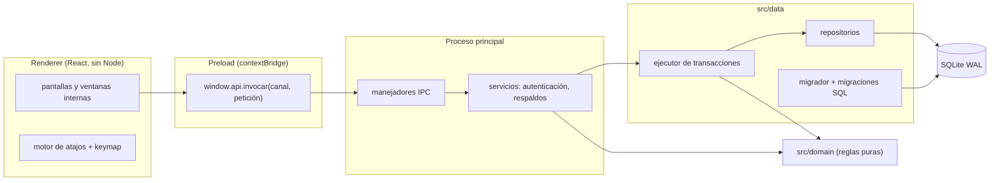
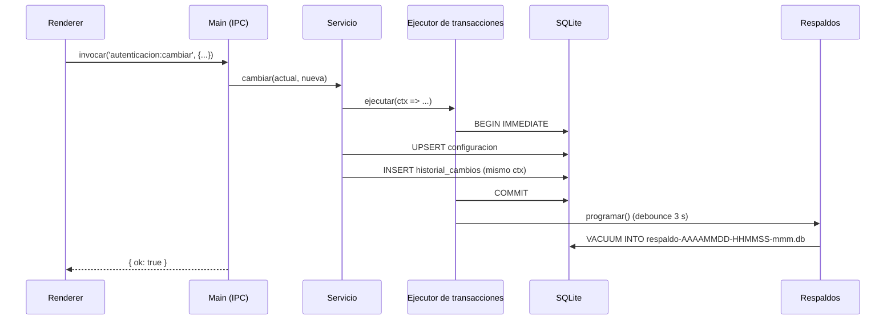

# Arquitectura

## Capas

La aplicación es una sola ventana de Electron. Las capas se comunican solo en el sentido de las flechas; ninguna se salta otra.

- **`src/domain/`**: reglas de negocio puras, sin Electron ni base de datos. Es lo más probado.
- **`src/data/`**: SQLite con `better-sqlite3` (síncrono). Toda escritura pasa por el **ejecutor de transacciones**, que abre una transacción `IMMEDIATE`, registra el historial de cambios en la misma transacción y, al confirmar, programa el respaldo.
- **`src/main/`**: arranque, ventana segura (`contextIsolation`, `sandbox`, sin `nodeIntegration`, CSP, sin navegación ni ventanas emergentes), IPC y servicios.
- **`src/preload/`**: expone solo `window.api` con una lista blanca de canales.
- **`src/shared/`**: contrato IPC tipado, `keymap`, catálogo de procesos y formatos. Lo usan todas las capas.
- **`src/renderer/`**: interfaz React.

## Contrato IPC

Los canales se declaran una sola vez en `src/shared/ipc/contrato.ts` (`ContratoIpc`). Cada respuesta es un `Resultado<T>`:

- `{ ok: true, datos }` si la operación salió bien.
- `{ ok: false, error: { codigo, mensaje } }` si falló. Los `ErrorDeNegocio` llevan su mensaje en español para el usuario; cualquier otro error se registra en `logs/sistema.log` y el usuario ve un mensaje genérico.

Los canales que modifican datos exigen sesión iniciada (contraseña ingresada).

## Flujo de una escritura

Si algo falla antes del `COMMIT`, se revierte todo: ni el cambio ni su historial quedan guardados, y no se programa respaldo.

## Interfaz: ventanas internas y atajos

- **Gestor de ventanas** (`renderer/ventanas/gestor.ts`): reductor puro. El orden del arreglo es el orden de apilado; la última ventana es la activa. Un proceso abre una sola ventana (D-04).
- **Motor de atajos** (`renderer/atajos/`): un único escuchador de teclado en fase de captura despacha cada combinación a **capas** con prioridad `modal` > `ventana` > `global`. Una capa modal (diálogo, buscador) bloquea las de abajo. Un manejador puede devolver `false` para «no lo manejé» y dejar pasar la tecla (así Esc «retrocede»: primero la ventana, luego el cierre global).
- Las combinaciones reservadas por Chromium (Ctrl+P, Ctrl+D, Ctrl+0, zoom, recarga…) se interceptan siempre. Además, la app no tiene menú de aplicación y el zoom se fija al 100 %.

## Modelo de datos (Fase 0)

La Fase 0 crea solo la infraestructura. Las tablas de negocio llegan con migraciones nuevas en cada fase (`0002_maestros` en la Fase 1, y así).

- `historial_cambios` es de solo inserción (triggers que abortan `UPDATE` y `DELETE`).
- `consecutivos` arranca en 101 (productos) y 10001 (clientes y proveedores).
- Todas las tablas son `STRICT`.

## Arranque

1. Bloqueo de instancia única (dos procesos sobre la misma base causarían bloqueos).
2. Log en `logs/sistema.log`.
3. Apertura de la base y `PRAGMA integrity_check`; si falla, la app no continúa (D-18).
4. Si la base ya existía, copia previa (D-19); luego se aplican las migraciones pendientes, verificando que las ya aplicadas no hayan cambiado.
5. Servicios, IPC y ventana.
6. Al salir: se hace la copia pendiente y se cierra la base.
